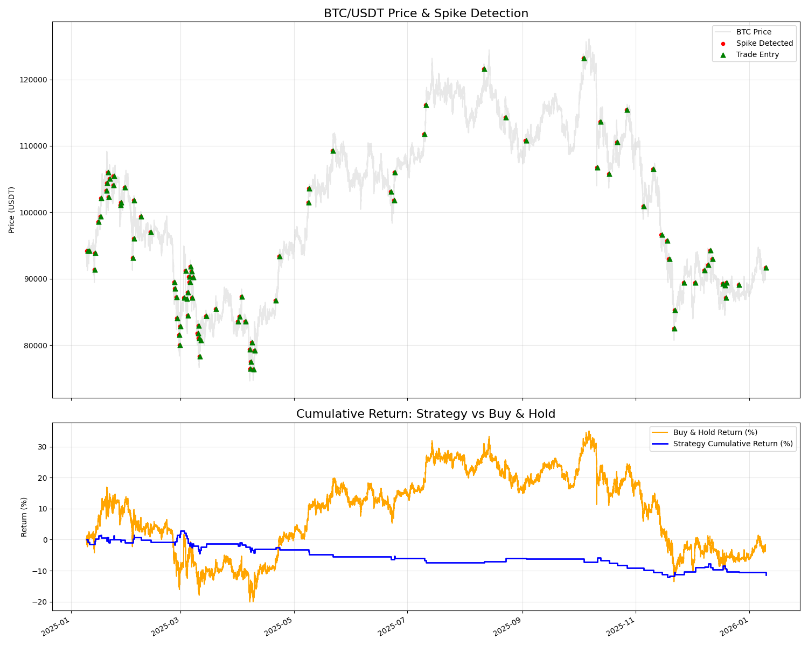

# Bitcoin Price Spike & Trading Signal System

A core logic implementation for an automated trading system that monitors Bitcoin (BTC) price spikes and simulates trade execution with backtesting capabilities.

## Project Features

1.  **Price Spike Detection (Part 1)**:
    *   Uses a **60-minute rolling window** to monitor price movements.
    *   Triggers when BTC price increases by **at least 2%** within the window.
    *   Implements a **300-minute cooldown** period after each trigger to prevent over-trading.
    *   Efficient data processing using a `deque` sliding window ($O(N)$ complexity).
2.  **Trading Simulation & Backtesting (Part 2)**:
    *   **Entry**: Market BUY at the spike detection price.
    *   **Take-profit (TP)**: +1%
    *   **Stop-loss (SL)**: -0.7%
    *   **Max Holding Time**: 180 minutes.
    *   **Metrics**: Reports total trades, win rate, average return, cumulative return, and Max Drawdown.
3.  **Benchmarking**:
    *   Compares the strategy performance against **Buy & Hold**.
    *   Calculates the **Calmar Ratio** (Return/MDD) to evaluate risk-adjusted returns.
4.  **Visualization**:
    *   Generates charts showing BTC price action, spike signals, trade entries, and cumulative equity curves.

## Project Structure

```text
trading_signal/
├── data/
│   └── download_data.py    # Data downloader (Binance API via CCXT)
├── src/
│   ├── detector.py         # Spike detection logic (Sliding window)
│   ├── simulator.py        # Trade execution & backtest engine
│   └── models.py           # Data structure definitions
├── main.py                 # Main backtest orchestration script
├── visualize.py            # Visualization script (Matplotlib)
├── test_logic.py           # Mini test case for logic verification
├── btc_price_data.csv      # (Generated) 1-year BTC historical data
├── spike_events.csv        # (Generated) Log of all detected spikes
└── trade_records.csv       # (Generated) Detailed history of all trades
```

## Quick Start

### 1. Environment Setup
Python 3.10+ is recommended.
```bash
conda create -n trading_signal python=3.10
conda activate trading_signal
pip install pandas ccxt requests tqdm matplotlib
```

### 2. Download Data
Fetch the last 1 year of BTC 1-minute OHLCV data:
```bash
python data/download_data.py
```

### 3. Run Backtest
Execute the full backtest and view the performance summary:
```bash
python main.py
```

### 4. Generate Visualization
Create the `backtest_visualization.png` chart:
```bash
python visualize.py
```

### 5. Run Mini Test
Verify the core spike and cooldown logic with a controlled example:
```bash
python test_logic.py
```

## Backtest Results Summary (Jan 2025 - Jan 2026)

| Metric | Spike Strategy | Buy & Hold |
| :--- | :--- | :--- |
| **Cumulative Return** | **-11.42%** | **-2.69%** |
| **Max Drawdown** | **15.05%** | **35.99%** |
| **Calmar Ratio** | **-0.76** | **-0.07** |
| **Total Trades** | 95 | N/A |
| **Win Rate** | 37.89% | N/A |
| **Avg. Return per Trade** | -0.12% | N/A |
| **Total Spikes Detected** | 95 | N/A |
| **Data Duration** | ~1 Year (526k mins) | ~1 Year (526k mins) |



### Key Observations:
1.  **Risk Reduction**: The strategy significantly outperformed Buy & Hold in terms of risk management, reducing the **Max Drawdown from ~36% to ~15%**.
2.  **Profitability**: During this specific 1-year period where BTC was slightly bearish/sideways, the "chasing spikes" logic resulted in a lower win rate (37.89%), as many spikes were followed by immediate pullbacks that hit the 0.7% stop-loss.
3.  **Trade Frequency**: On average, the strategy found a valid spike and entered a trade every ~3.8 days.
